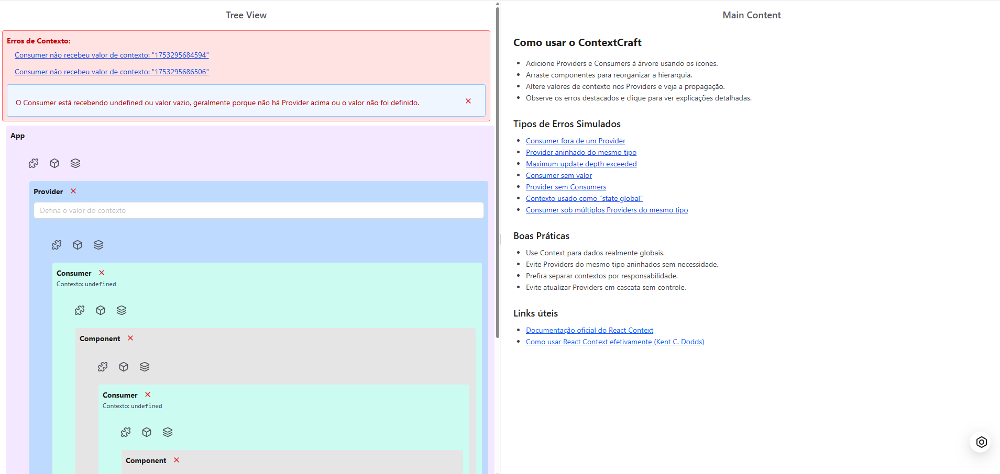
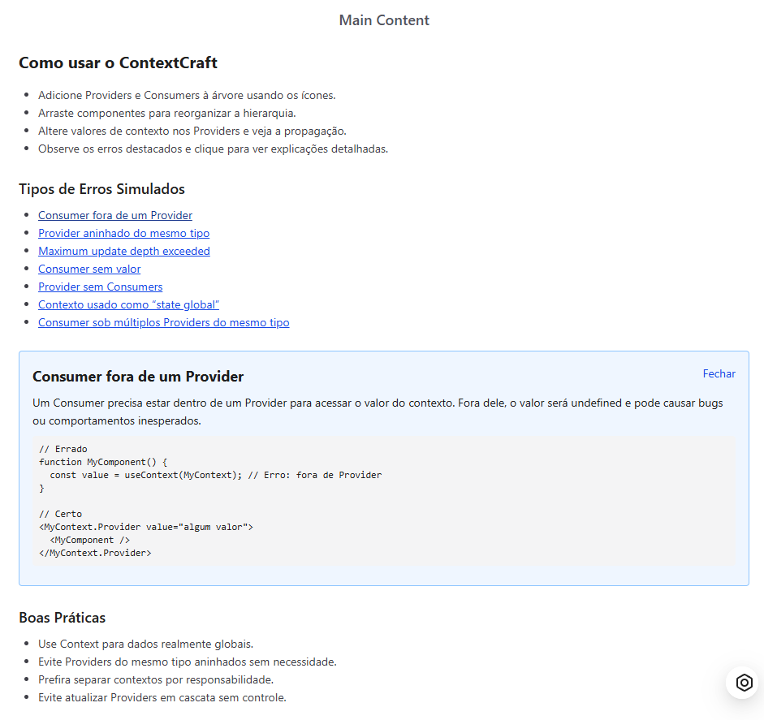

# 🧠 ContextCraft – Visualize, entenda e domine o React Context

**ContextCraft** é uma ferramenta interativa e educativa que te ajuda a **visualizar, testar e entender** a Context API do React de forma clara e divertida.

Ideal para quem:
- Está aprendendo React
- Tem dúvidas sobre como o Context se propaga
- Já sofreu com erros como "useContext must be inside a Provider"
- Quer entender **boas práticas e armadilhas comuns** da Context API

---

## Demonstração




---

## ✨ Funcionalidades (MVP)

- 🔁 Atualização de valores em tempo real via UI
- 🎯 Destaque visual de componentes que re-renderizam
- ⚠️ Simulação de erros comuns com explicações guiadas
- 🧩 Visualização da árvore de Providers e Consumers
- 💬 Painel lateral com insights, boas práticas e mensagens didáticas
- 💾 Salvamento automático da simulação no `localStorage`

---

## 📚 Exemplo de erros cobertos

- `useContext` fora de um `Provider`
- `Maximum update depth exceeded`
- Re-renderizações desnecessárias
- `React.memo` sendo ignorado por contextos mutáveis
- Contexto usado como “state global” sem separação de responsabilidades

---

## 🛠️ Tecnologias utilizadas

- ⚛️ React + Vite
- 🎨 TailwindCSS
- 🎞️ Framer Motion (para animações visuais)
- 🧪 Context API
- 💾 LocalStorage (para persistência simples)

---

## 📦 Instalação

```bash
git clone https://github.com/seu-usuario/contextcraft.git
cd contextcraft
npm install
npm run dev
```

---

# 📌 Roadmap (em progresso)

[ ] Tree View visual de componentes

[ ] Efeitos de re-renderização em tempo real

[ ] Modo "Debug": logs com sugestões

[ ] Exportar código do sandbox como snippet

[ ] Versão multilíngue (PT-BR / EN)

[ ] Compartilhamento via link (URL encodada)

---

# 🤝 Contribuição

Pull requests são bem-vindos! Se quiser sugerir novos cenários de erro, refatorações ou melhorias de UI, fique à vontade.


---

# 🧠 Licença

MIT — sinta-se livre para usar, remixar e contribuir.


---

# 👨‍💻 Autor

Feito com ❤️ por Luiz
